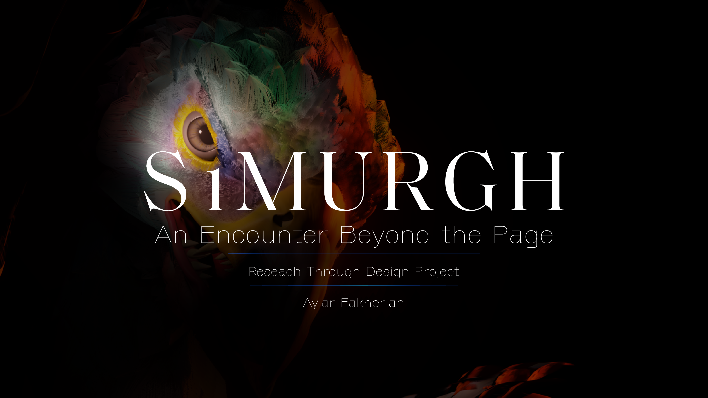

# Simurgh — Interactive VR Experience for Digital Cultural Heritage

### Research through Design Investigation

An immersive Virtual Reality experience exploring how interactive systems can create meaningful encounters with intangible cultural heritage through embodiment, narrative, and digital experience design.

> Simurgh is a Research through Design project investigating how immersive Virtual Reality experiences can transform intangible cultural heritage from something that is observed into something that can be encountered, interpreted, and experienced.

---

# Project Overview

| Category | Description |
|---|---|
| Project | Simurgh — Interactive VR Experience |
| Research Approach | Research through Design (RtD) |
| Research Domain | Digital Cultural Heritage |
| Medium | Virtual Reality (Unity + Blender) |
| Status | Prototype · Conference Paper Under Review |

---

# Research Question

**How can immersive Virtual Reality experiences support meaningful encounters with intangible cultural heritage?**

---

# Project Status

**Conference Paper:** Submitted to ArtsIT 2026 *(Under Review)*

This repository documents the research process, design iterations, prototype development, and research outputs of the Simurgh project.

---

# Research Context

The Simurgh has existed for centuries across Persian literature, miniature painting, architecture, and collective imagination.

Rather than attempting to digitally reconstruct or represent a mythical creature, this project explores how immersive interaction can create new ways of engaging with cultural narratives.

Using the Simurgh as a case study, the project applies **Research through Design (RtD)** and **Practice-Based Research (PBR)** approaches to investigate how culturally informed VR experiences can shape interpretation, engagement, and embodied interaction.

---

# Research Approach

The project combines:

- Research through Design (RtD)
- Practice-Based Research (PBR)
- Cultural narrative analysis
- Character and environment design
- Interactive VR prototyping
- Qualitative experience evaluation

---

# Research Contribution

This project investigates an RtD approach for designing immersive cultural experiences by integrating:

- Cultural analysis
- Narrative interpretation
- Character design
- Interactive system development
- User experience evaluation

The research explores how Virtual Reality can move beyond passive visualization of heritage and support embodied encounters with symbolic meanings, cultural narratives, and collective imagination.

---

# Prototype Features

The current prototype explores:

- Interactive Virtual Reality environment
- Narrative-driven exploration
- Environmental storytelling
- Character-based cultural interaction
- Spatial interaction
- Immersive audiovisual experience

---

# Evaluation

The prototype was explored through qualitative user sessions focusing on:

- User engagement
- Sense of immersion
- Interaction experience
- Cultural interpretation
- Overall experience

Insights from evaluation informed iterative refinement of the research prototype.

---

# Research Perspective

Rather than asking:

> How can Virtual Reality visualize cultural heritage?

This project explores:

> How can immersive experiences participate in the interpretation, engagement, and continued evolution of cultural knowledge?

---

# Technology

- Unity
- Blender
- XR Interaction Toolkit
- OpenXR
- C#
- Git & GitHub

---

# Current Outputs

- Interactive VR Prototype
- Conference paper submitted to ArtsIT 2026
- Research documentation
- Design iterations
- Prototype development archive

---

# Keywords

Research through Design · Practice-Based Research · Human-Centred Design · Virtual Reality · XR · Digital Cultural Heritage · Immersive Experiences · Interactive Systems · Cultural Engagement · User Experience

---

# Repository Roadmap

Future updates will include:

- Research documentation
- Design process
- Prototype architecture
- Unity project files
- Design reflections
- Evaluation insights
- Publications
- Media assets

---

# Related Links

## Research Case Study

Behance:

https://www.behance.net/gallery/253057297/Simurgh-Interactive-VR-Experience

---

## Interactive Prototype

Vimeo:

https://vimeo.com/1211521489

---

## Publication

**Design and Evaluation of an Interactive Virtual Reality Experience for Transmitting Intangible Cultural Heritage: A Case Study of the Simurgh Myth**

Submitted to ArtsIT 2026 *(Under Review)*

---

# Citation

Citation information will be added following the publication process.

---

*This repository is actively maintained as part of an ongoing Research through Design investigation into immersive experiences, XR, and digital cultural heritage.*
